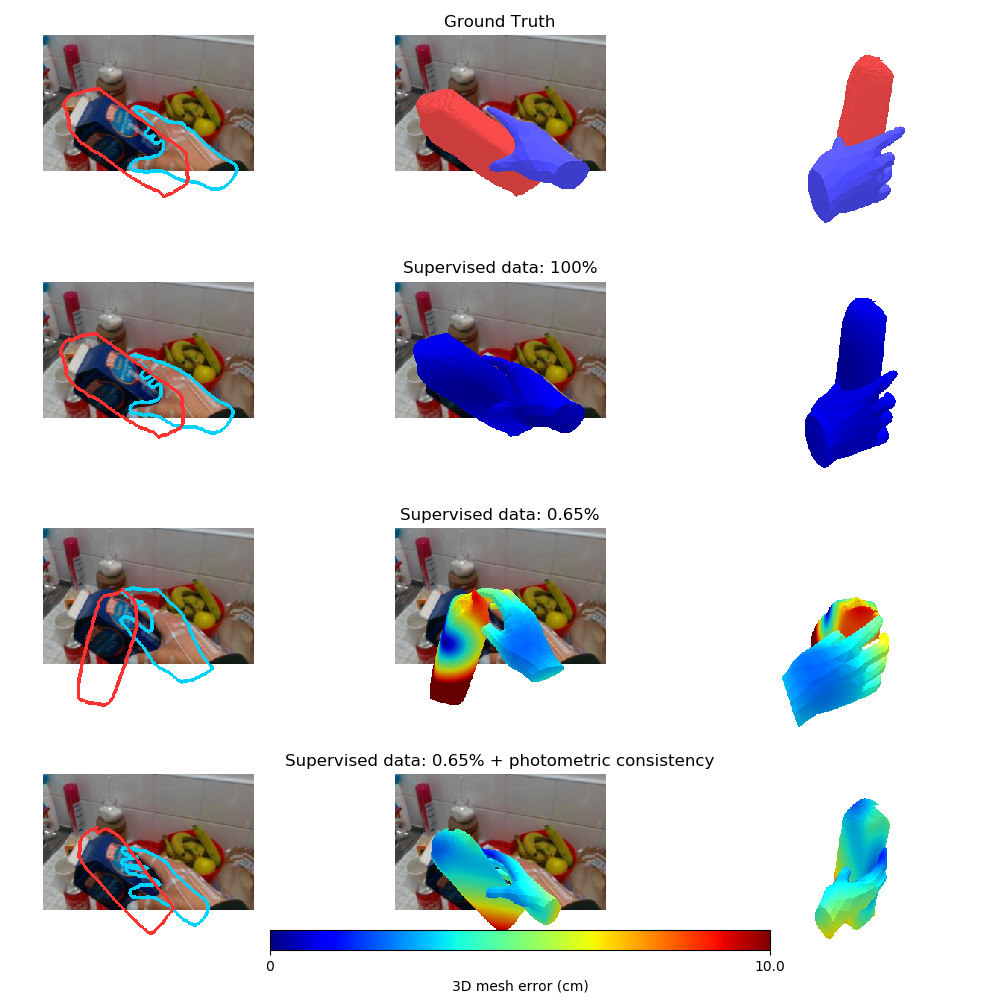

# Leveraging Photometric Consistency over Time for Sparsely Supervised Hand-Object Reconstruction

Yana Hasson, Bugra Tekin, Federica Bogo, Ivan Laptev, Marc Pollefeys, and Cordelia Schmid

- [Project page](https://hassony2.github.io/handobjectconsist.html)
- [Paper](http://arxiv.org/abs/2004.13449)

### Table of Content

- [Setup](#setup)
  - [Download and install code](#download-and-install-code)
  - [Download datasets](#download-datasets)
- [Demo](#demo)
- [Training](#training)
  - [Train model for joint hand-object pose estimation](#baseline-model-for-joint-hand-object-pose-estimation)
  - [Train in sparsely annotated setting on FPHAB dataset](#train-in-sparsely-annotated-setting)
- [Acknowledgements](#acknowledgement)


# Setup

## Download and install code

- Retrieve the code
```sh
git clone https://github.com/hassony2/handobjectconsist`
cd handobjectconsist
```

- Create and activate the virtual environment with python dependencies
```
conda env create --file=environment.yml
conda activate handobject_env
```

### Download the MANO model files

- Go to [MANO website](http://mano.is.tue.mpg.de/)
- Create an account by clicking *Sign Up* and provide your information
- Download Models and Code (the downloaded file should have the format mano_v*_*.zip). Note that all code and data from this download falls under the [MANO license](http://mano.is.tue.mpg.de/license).
- unzip and copy the content of the *models* folder into the `assets/mano` folder


- Your structure should look like this:

```
handobjectconsist/
  assets/
    mano/
      MANO_LEFT.pkl
      MANO_RIGHT.pkl
      fhb_skel_centeridx9.pkl
```

## Download datasets

### First-Person Hand Action Benchmark (FPHAB)

- Download the First-Person Hand Action Benchmark dataset following the [official instructions](https://github.com/guiggh/hand_pose_action) to the `data/fhbhands` folder
- Unzip the `Object_models`

`unzip data/fhbhands/Object_models.zip -d data/fhbhands`

- Unzip MANO fits

`tar -xvf assets/fhbhands_fits.tgz -C assets/`

- Download [pre-trained models](https://github.com/hassony2/handobjectconsist/releases/download/v0.1/releasemodels.zip)

`wget https://github.com/hassony2/handobjectconsist/releases/download/v0.2/releasemodels.zip`

`unzip releasemodels.zip`

- *Optionally*, resize the images (speeds up training !)
  - `python reduce_fphab.py`

- Your structure should look like this:

```
data/
  fhbhands/
    Video_files/
    Video_files_480/  # Optional, created by reduce_fphab.py script
    Subects_info/
    Object_models/
    Hand_pose_annotation_v1/
    Object_6D_pose_annotation_v1_1/
assets/
  fhbhands_fits/
releasemodels/
  fphab/
     ...
```

### HO3D

*Optional*: Download the [HO3D-v2](https://files.icg.tugraz.at/d/76661ed06445490ab21c/) dataset.
Note that all results in our paper are reported on a **subset** of the current dataset which was published as an [early release](https://arxiv.org/abs/1907.01481v1).
The results are therefore *not directly comparable* with the [final published results](https://arxiv.org/abs/1907.01481) which are reported on the v2 version of the dataset.

# Demo

Run the demo on the FPHAB dataset.

```sh
python visualize.py
```

This script loads three models and visualizes their predictions on samples from the test split of FPHAB:

- a model trained on the full FPHAB dataset
- a model trained with only a fraction (<1%) of the full ground truth annotations finetuned **with** photometric consistency
- a control model trained with the same fraction of the full ground truth annotations finetuned **without** photometric consistency

It produces images such as the following:




# Training

Run the training code

### Baseline model for joint hand-object pose estimation

Train baseline model of **entire** FPHAB (100% of the data is supervised with 3D annotations)

```sh
python trainmeshreg.py --freeze_batchnorm --workers 8 --block_rot
```

### Train in sparsely annotated setting


- **Step 1**: Train baseline model on a fraction of the FPHAB dataset (here 0.65%)

```sh
python trainmeshreg.py --freeze_batchnorm --workers 8 --fraction 0.00625 --eval_freq 50
```

- **Step 2**: Resume training, adding photometric supervision

Step 1 will have produced a trained model which will be saved in a subdirectory of `checkpoints/fhbhands_train_mini1/{data_you_launched_trainings}/`.

Step 2 will **resume** training from this model, and further train with the additional photometric consistency loss on the frames for which the ground truth annotations are not used.

`python trainmeshwarp.py --freeze_batchnorm --consist_gt_refs --workers 8 --fraction 0.00625 --resume checkpoints/path/to/saved/checkpoint.pth`

- *Optional*: For fair comparison (same number of training epochs), training can also be resumed **without** photometric consistency (this shows that the improvement does not come simply from longer training)

`python trainmeshwarp.py --freeze_batchnorm --consist_gt_refs --workers 8 --fraction 0.00625 --resume checkpoints/path/to/saved/checkpoint.pth --lambda_data 1 --lambda_consist 0`

## Citation

If you find this code useful for your research, consider citing our paper:

```
@INPROCEEDINGS{hasson20_handobjectconsist,
	       title     = {Leveraging Photometric Consistency over Time for Sparsely Supervised Hand-Object Reconstruction},
	       author    = {Hasson, Yana and Tekin, Bugra and Bogo, Federica and Laptev, Ivan and Pollefeys, Marc and Schmid, Cordelia},
	       booktitle = {CVPR},
	       year      = {2020}
}
```

## To fix

Thanks to [Samira Kaviani](https://www.roboticvision.org/rv_person/samira-kaviani/) for spotting that in Table 2. the splits are different because I previously filtered out frames for which hands are further than 10cm away from the object !
I will rerun the results beginning September and update them here.

## Acknowledgements

### Code

For this project, we relied on research code from:

- [PWC-Net](https://github.com/NVlabs/PWC-Net) for [image warping utilities](https://github.com/NVlabs/PwidthC-Net/blob/master/PyTorch/models/PWCNet.py#L139).
- [Christian Zimmermann](https://lmb.informatik.uni-freiburg.de/people/zimmermc/) for [hand evaluation code from hand3d](https://github.com/lmb-freiburg/hand3d)
- the [PyTorch port](https://github.com/daniilidis-group/neural_renderer) of [Neural Renderer](https://github.com/hiroharu-kato/neural_renderer).

### Advice and discussion

I would like to specially thank [Shreyas Hampali](https://www.tugraz.at/institute/icg/research/team-lepetit/people/shreyas-hampali/) for advice on the [HO-3D dataset](https://www.tugraz.at/institute/icg/research/team-lepetit/research-projects/hand-object-3d-pose-annotation/) and [Guillermo Garcia-Hernando](https://guiggh.github.io/) for advice and on the [FPHAB dataset](https://github.com/guiggh/hand_pose_action).

I would also like to thank [Mihai Dusmanu](https://dsmn.ml/), Yann Labbé and  [Thomas Eboli](https://twitter.com/ebolithomas?lang=en) for helpful discussions and proofreading !
